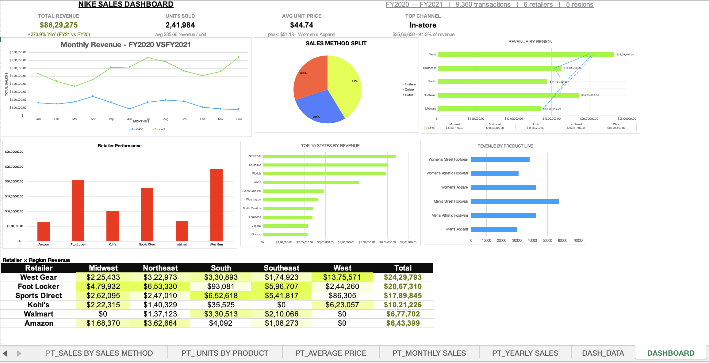

# 📊 Nike Sales Analysis Dashboard — Excel


# 📊 Nike Sales Analysis Dashboard — Excel

An interactive **Nike Sales Analysis Dashboard** built in Microsoft Excel to analyze sales performance across time, regions, states, retailers, sales channels, and product lines.

The project focuses on transforming sales data into an interactive and business-friendly dashboard that can be used to identify trends, compare performance, and support data-driven decision-making.

---

## 🎯 Project Objective

The objective of this project was to analyze Nike sales data and create an interactive dashboard that provides a clear overview of business performance.

The dashboard answers key business questions such as:

- How much revenue was generated?
- How is revenue changing year over year?
- How many units were sold?
- What is the average unit price?
- Which sales channel generates the most revenue?
- Which regions perform best?
- Which states generate the highest revenue?
- Which retailers contribute the most revenue?
- Which product lines drive sales?
- How does revenue change month by month?

---

## 🛠️ Tools & Skills Used

- **Microsoft Excel**
- PivotTables
- PivotCharts
- Slicers
- Data Filtering
- Data Aggregation
- Data Analysis
- KPI Development
- Dashboard Design
- Interactive Data Visualization

---

## 📌 Key Performance Indicators (KPIs)

The dashboard includes the following KPIs:

### 💰 Total Revenue
Measures the overall revenue generated from sales.

### 📦 Units Sold
Shows the total quantity of products sold and helps measure sales volume.

### 💵 Average Unit Price
Shows the average selling price per unit and helps understand pricing levels.

### 📈 YoY Revenue Growth
Compares revenue performance across fiscal years to identify growth or decline.

### 🏪 Top Sales Channel
Identifies the sales channel contributing the highest share of revenue.

---

## 📊 Dashboard Analysis

### 1. Monthly Revenue — FY2020 vs FY2021

A monthly comparison of revenue between FY2020 and FY2021.

This helps identify:

- Monthly sales trends
- Seasonal patterns
- High-performing months
- Changes in performance between fiscal years

---

### 2. Revenue by Region

Analyzes revenue across different geographical regions.

This helps identify:

- High-performing regions
- Low-performing regions
- Regional sales opportunities

---

### 3. Revenue by Retailer

Compares revenue generated through different retailers.

This can help businesses understand which retail partners contribute most to overall sales.

---

### 4. Top 10 States by Revenue

Identifies the ten states generating the highest revenue.

This helps highlight the strongest geographic markets and potential areas for further analysis.

---

### 5. Revenue by Product Line

Shows how different Nike product lines contribute to overall revenue.

This helps identify:

- Strong-performing product lines
- Lower-performing product lines
- Product categories that may require further investigation

---

## 🎛️ Interactive Dashboard

The dashboard uses **Excel Slicers** to allow users to interactively filter the data.

Users can select different categories and immediately see the connected KPIs, PivotTables, and charts update accordingly.

This makes the dashboard useful for exploring the data from different perspectives rather than relying on a static report.

---

## 🔍 Key Business Insights

The dashboard is designed to help stakeholders quickly identify:

- Overall sales performance
- Year-over-year revenue changes
- Monthly sales trends
- Regional performance
- State-level performance
- Retailer contribution
- Product-line contribution
- Sales-channel performance

---

## 💡 Why These KPIs?

The KPIs were selected to provide different perspectives of sales performance.

| KPI | Business Question |
|---|---|
| Total Revenue | How much revenue are we generating? |
| Units Sold | How many products are we selling? |
| Average Unit Price | What is the average selling price? |
| YoY Growth | Is revenue increasing or decreasing? |
| Top Channel | Which channel contributes the most revenue? |

Together, these metrics provide a more complete view than revenue alone.

---

## 📁 Project Structure

```text
Nike-Sales-Analysis/
│
├── Nike_Dashboard.xlsx
├── Dashboard.png
└── README.md


# nike-sales-analysis-excel-dashboard
Interactive Nike Sales Analysis Dashboard built in Microsoft Excel using PivotTables, PivotCharts, Slicers, KPIs, and data visualization.
